# Journal App

## Table of Contents

- [User Manual](#user-manual)
- [Preplanning](#preplanning)
  - [Core Features](#core-features)
  - [What Additional Feature I Will Add](#what-additional-features-i-will-add)
  - [Flowchart](#flowchart)
  - [UI Desing](#ui-design)
    - [Entry View](#entry-view)
    - [Calendar View](#calendar-view)
  - [Suggested Systems](#suggested-systems)
  - [If I Get More Time](#if-i-get-more-time)
- [Development](#development)
  - [Prototype 1](#prototype-1-base-systems-finished---text-edit-save-load-calendar-selection)
    - [Code as of commit 23](#code-as-of-commit-23)
    - [Video Of Functionality](#video-of-functionality)
    - [New UI Elements](#new-ui-elements)
    - [Issues And Solutions](#issues-and-solutions)
  - [Prototype 2](#prototype-2-themes-and-more-advanced-text-options)
    - [Code as of commit 33](#code-as-of-commit-33)
    - [Video Of Functionality](#video-of-functionality-1)
    - [New UI Elements](#new-ui-elements-1)
    - [Issues And Solutions](#issues-and-solutions-1)
  - [Prototype 3](#prototype-3-pinning-catogoriesing)
    - [Code as of commit 46](#code-as-of-commit-46)
    - [Video Of Functionality](#video-of-functionality-2)
    - [New UI Elements](#new-ui-elements-2)
    - [Issues And Solutions](#issues-and-solutions-2)
  - [Prototype 4](#prototype-4-suggested-systems---todo-list)
    - [Code as of Commit XX](#code-as-of-commit-60)
    - [Video Of Functionality](#video-of-functionality-3)
    - [New UI Elements](#new-ui-elements-3)
    - [Issues And Solutions](#issues-and-solutions-3)
  - [Prototype 5](#prototype-5-suggested-systems---gym-tracking)
    - [Code as of Commit xx](#code-as-of-commit-69)
    - [Video Of Functionality](#video-of-functionality-4)
    - [New UI Elements](#new-ui-elements-4)
    - [Issues And Solutions](#issues-and-solutions-4)
  - [Prototype 6](#prototype-6-sorting-and-searching)
    - [Code as of XX](#code-as-of-commit-xx)
    - [Video Of Functionality](#video-of-functionality-5)
    - [New UI Elements](#new-ui-elements-5)
    - [Issues And Solutions](#issues-and-solutions-5)
  - [Prototype 7](#prototype-7-if-i-get-more-time)
    - [Code as of Commit xx](#code-as-of-commit-xx-1)
    - [Video Of Functionality](#video-of-functionality-6)
    - [New UI Elements](#new-ui-elements-6)
    - [Issues And Solutions](#issues-and-solutions-6)
- [Reflection](#reflection)
  - [How Is The Overall Design](#how-is-the-overall-design)
  - [What Changes Can I Make](#what-changes-can-i-make)
  - [What Issues Were Encountered](#what-issues-were-encountered)
  - [What Techniques Did You Use To Solve These Issues](#what-techniques-did-you-use-to-solve-these-issues)
  - [What Have I Learnt From The Project](#what-have-i-learnt-from-the-project)
- [Sources](#sources)

## User Manual

Calendar Page:

Entry Page:

Side bar:

Themes:

Todo List:

Gym Tracker:

## Preplanning

### Core Features

Calendar Selection: the ability to view a calendar page and select a date to view. Dates with entries are highlighted.

Text Editor: Basic area which can have text entered into.

Save and Load: The saving of entries and their dates.

### What Additional Features I Will Add

Themes: The abilitie to change the appearance of the app to one of many preset themes, maybe expand to fully customisable without presets.

Advanced Text Settings: Enable bold, italic, and text size, maybe also color other than the theme one, maybe highlights.

Favourourite / Pinned: Enable the favouriting and pinning of entires which will be at the top of the side pannel even when sorting.

Catogories: Abilitie to enter any number of catogories in a field area, seperatored by commas.

Softing and filtering entries: Sort enries by date, title name, last opened and filter out specific catogories and uncatogoriesed entries.

Search Entries: a search field to look up entries based on their date or title.

### Flowchart

Belows is the flowchart on what order I wish to complete the assingment. Unfortionately after the making of the below Flowchart I added a new section on Suggested systems which goes inbetween the End section and if I Have more time.

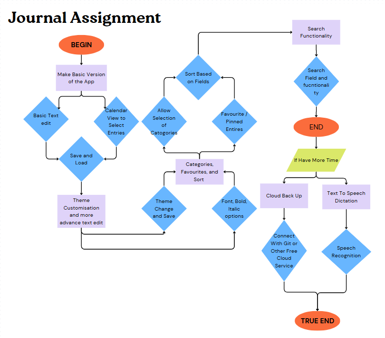

### UI Design

Simple UI that resembles a IDE with the files / entires on a sidebar to the left, and a central field used for the input of text and the calendar selcetion. With text options above the text field, and a save button below the text field which i might also enable with a button for ctrl+s, next to which is the section for editing catogories.

#### Entry View

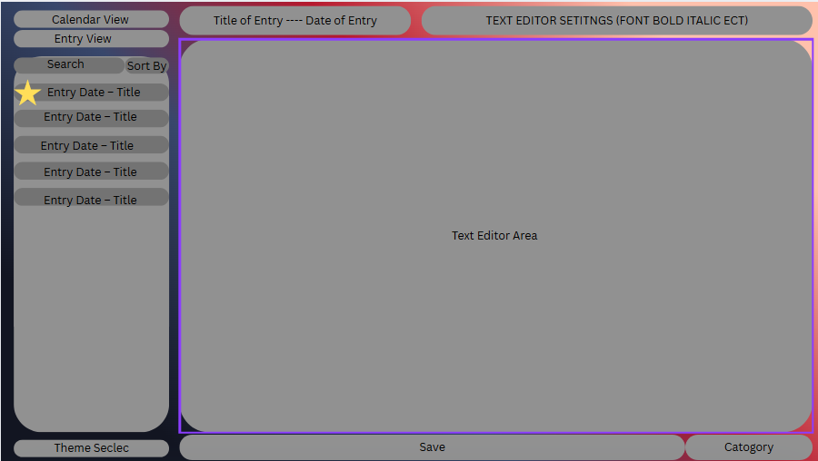

#### Calendar View

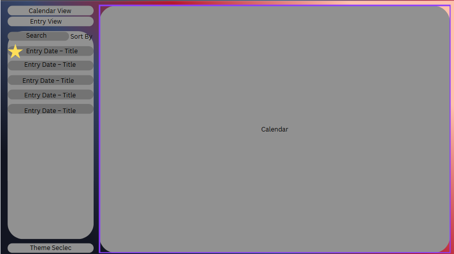

### Suggested Systems

After asking some or my peers i reseived the following suggestions:

To-Do List: Create a todo list where you can set a due date, and toggle between complete and incomplete. Also be able to see what is due today and what is overdue.

Events / Reminders: Allow the User to set reminders which it will then alert them of when it is near. Would require keeping the application open or finding a way to do it in a weird way.

Gym Tracking: Track what excersise you do, how many sets, reps and what weight it was.

Gabe has also suggested that i use some data prevention / guide user to save when they try to leave

I also questioned Kirsty which resulted in the following suggestions:

Change Font: Change between fonts for the Entries and maybe even the Ui of the App.

Emoji's or pictures to represent mood: Select a Emoji or picture to represent your mood that day.

Set the weather that day: Allow the user to select one or a few options for a weather button, or allow them to enter it in words.

### If I Get More Time

If i stop getting good suggestions from people, i intend to do the following if i get more time.

A Cloud back up system: Maybe use git or something similar to store entries.

Voice to text input: Possible text dictation but would require a mic and the ability to recognise words from the mic. 

## Development

### Prototype 1: Base Systems finished - Text Edit, Save Load, Calendar Selection

#### Code as of commit 23

```py

# ----- Sidebar -----
self.sidebar = QWidget()
sidebar_layout = QVBoxLayout(self.sidebar)

self.to_calendar_btn = QPushButton("Calendar View")
self.to_entry_btn = QPushButton("Entry View")
sidebar_layout.addWidget(self.to_calendar_btn)
sidebar_layout.addWidget(self.to_entry_btn)

# Entry list
self.entry_list = QListWidget()
sidebar_layout.addWidget(self.entry_list)

main_layout.addWidget(self.sidebar, 1)

```

```py

# ----- Calendar Page -----
self.calendar_page = QWidget()
cal_layout = QVBoxLayout(self.calendar_page)
self.calendar = QCalendarWidget()
cal_layout.addWidget(self.calendar)
self.stacked.addWidget(self.calendar_page)

# ----- Entry Page -----
self.entry_page = QWidget()
entry_layout = QVBoxLayout(self.entry_page)

self.entry_title_label = QLabel("No entry loaded")
entry_layout.addWidget(self.entry_title_label)

self.text_edit = QTextEdit()
entry_layout.addWidget(self.text_edit)

self.save_btn = QPushButton("Save Entry")
entry_layout.addWidget(self.save_btn)

self.stacked.addWidget(self.entry_page)

```

```py

# ----- Save and Load Entries -----
def save_entry(self):
    date = self.calendar.selectedDate().toString("yyyy-MM-dd")
    content = self.text_edit.toPlainText()

    existing = next((e for e in self.entries if e["date"] == date), None)
    if existing:
        existing["content"] = content
    else:
        title, ok = QInputDialog.getText(self, "Entry Title", "Enter a title for this entry:")
        if not ok or not title.strip():
            title = "Untitled"
        self.entries.append({"date": date, "title": title.strip(), "content": content})

    self.save_entries()
    self.refresh_entry_list()
    self.highlight_entries()

def load_entry_for_date(self):
    date = self.calendar.selectedDate().toString("yyyy-MM-dd")
    entry = next((e for e in self.entries if e["date"] == date), None)
    if entry:
        self.text_edit.setText(entry["content"])
        self.entry_title_label.setText(f"{entry['title']} - {date}")
    else:
        self.text_edit.clear()
        self.entry_title_label.setText(f"New Entry - {date}")

```

```py

# ----- Highlight Calendar Dates -----
def highlight_entries(self):
    theme = THEMES.get(self.current_theme, THEMES["Dark"])
    has_entry_format = QTextCharFormat()
    has_entry_format.setBackground(QBrush(QColor(theme["highlight"])))

    for entry in self.entries:
        date = QDate.fromString(entry["date"], "yyyy-MM-dd")
        self.calendar.setDateTextFormat(date, has_entry_format)

```

#### Video of Functionality

[](https://www.youtube.com/watch?v=QhN-gVlsF-o)

#### New UI Elements

The current interface consists of a sidebar and a stacked widget that switches between the calendar and entry views.  

##### Entry View

Users can write their journal entries, view the date, and save the entries.

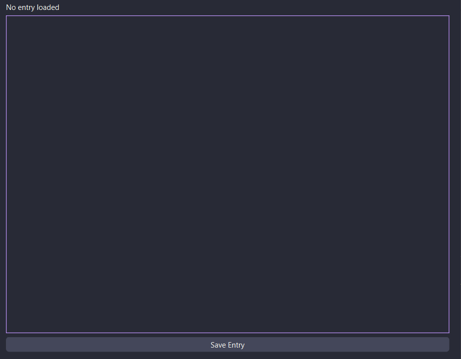

##### Calendar View

Users can select dates and view which days have entries already.

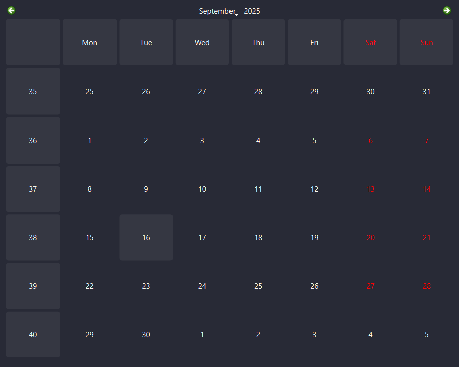

##### Side Bar

Users can use the sidebar to switch between the views aswell as view all entries. 


#### Issues and Solutions

I use Linux at home and Windows for school, and I also needed to make this project usable for you. This required making the file-loading systems cross-OS compatible, which required handling the different slashes used in file directories. 

This was fixed by using `os.path.join()` so python automatcally uses the correct file depending on the operating system. 

### Prototype 2: Themes and More advanced text options

#### Code as of commit 33

```py

# Theme selector in sidebar
self.theme_selector = QComboBox()
self.theme_selector.addItems(THEMES.keys())
sidebar_layout.addWidget(self.theme_selector)
self.theme_selector.currentTextChanged.connect(self.apply_theme)

```

```py

def save_entry(self):
    date = self.calendar.selectedDate().toString("yyyy-MM-dd")
    content = self.text_edit.toHtml()

    # find existing entry for date
    existing = next((e for e in self.entries if e["date"] == date), None)

    if existing:
        existing["content"] = content
    else:
        # Prompt for a title when creating a new entry
        title, ok = QInputDialog.getText(self, "Entry Title", "Enter a title for this entry:")
        if not ok or not title.strip():
            title = "Untitled"
        self.entries.append({"date": date, "title": title.strip(), "content": content})

    self.save_entries()
    self.refresh_entry_list()
    self.highlight_entries()
   
```

```py

# Advanced text fuctions
def toggle_bold(self):
    fmt = self.text_edit.currentCharFormat()
    fmt.setFontWeight(QFont.Weight.Bold if self.bold_btn.isChecked() else QFont.Weight.Normal)
    self.text_edit.setCurrentCharFormat(fmt)

def toggle_italic(self):
    fmt = self.text_edit.currentCharFormat()
    fmt.setFontItalic(self.italic_btn.isChecked())
    self.text_edit.setCurrentCharFormat(fmt)

def change_font_size(self, size):
    fmt = self.text_edit.currentCharFormat()
    fmt.setFontPointSize(size)
    self.text_edit.setCurrentCharFormat(fmt)

```

#### Video of Functionality

[](https://www.youtube.com/watch?v=wpqoa20dFwM)

#### New UI Element

Theme selector as a dropdown from the sidebar. 

Text formatting section in the entry view with a bold, italic and font size selector. 

##### Theme Selector

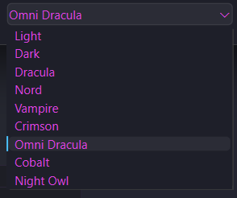

##### Text options

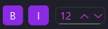

#### Issues and Solutions


### Prototype 3: Pinning, catogoriesing

#### Code as of commit 46

```py

# Pin toggle button in entry header
self.pin_btn = QPushButton("📌")
self.pin_btn.setCheckable(True)
self.pin_btn.setFixedSize(24, 24)
self.pin_btn.toggled.connect(self.toggle_pin)
header_layout.addWidget(self.pin_btn)

# Categories button in actions row
self.categories_btn = QPushButton("🏷")
self.categories_btn.setFixedSize(24, 24)
self.categories_btn.clicked.connect(self.edit_categories)
actions_layout.addWidget(self.categories_btn)

# Delete button in sidebar
self.delete_btn = QPushButton("Delete Entry")
self.delete_btn.clicked.connect(self.delete_entry)
sidebar_layout.addWidget(self.delete_btn)

```

```py

# Refresh entry list with pinned items first
def refresh_entry_list(self):
    self.entry_list.clear()

    pinned = [e for e in self.entries if e.get("pinned")]
    others = [e for e in self.entries if not e.get("pinned")]

    pinned = sorted(pinned, key=lambda x: x["date"])
    others = sorted(others, key=lambda x: x["date"])

    def make_item(entry, pinned=False):
        cats = ", ".join(entry.get("categories", []))
        label = f"{'📌 ' if pinned else ''}{entry['date']} - {entry['title']} "
        if cats:
            label += f" [{cats}]"
        item = QListWidgetItem(label)
        item.setData(Qt.ItemDataRole.UserRole, entry["date"])
        return item

    for entry in pinned:
        self.entry_list.addItem(make_item(entry, pinned=True))

    for entry in others:
        self.entry_list.addItem(make_item(entry))

```

```py

# Categories editor
def edit_categories(self):
    date = self.calendar.selectedDate().toString("yyyy-MM-dd")
    entry = next((e for e in self.entries if e["date"] == date), None)
    if entry:
        current = ", ".join(entry.get("categories", []))
        text, ok = QInputDialog.getText(
            self, "Edit Categories", "Enter categories (comma-separated):", text=current
        )
        if ok:
            cats = [c.strip() for c in text.split(",") if c.strip()]
            entry["categories"] = cats
            self.save_entries()
            self.refresh_entry_list()

```

```py

# Delete entry with confirmation
def delete_entry(self):
    date = self.calendar.selectedDate().toString("yyyy-MM-dd")
    entry = next((e for e in self.entries if e["date"] == date), None)

    if not entry:
        QMessageBox.information(self, "No Entry", "There is no entry for this date to delete.")
        return

    reply = QMessageBox.question(
        self,
        "Delete Entry",
        f"Are you sure you want to delete the entry for {date}?",
        QMessageBox.StandardButton.Yes | QMessageBox.StandardButton.No
    )

    if reply == QMessageBox.StandardButton.Yes:
        self.entries = [e for e in self.entries if e["date"] != date]
        self.save_entries()
        self.refresh_entry_list()
        self.highlight_entries()
        self.text_edit.clear()
        self.entry_title_label.setText(f"Deleted Entry - {date}")

```

#### Video of Functionality

[](https://www.youtube.com/watch?v=w44o6xQUBmM)

#### New UI Elements

Pin Button

Catogory Button

Delete Button

##### Pinning

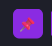

##### Catogories

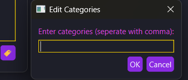

##### Side Bar With Pin and Catogories

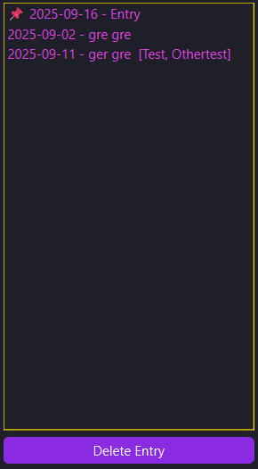

#### Issues and Solutions

### Prototype 4: Suggested Systems - Todo List

#### Code as of commit 60

```py

  

```

#### Video of Functionality

[](https://www.youtube.com/watch?v=JaybF-vf7mw)

#### New UI Elements

##### Todo Page

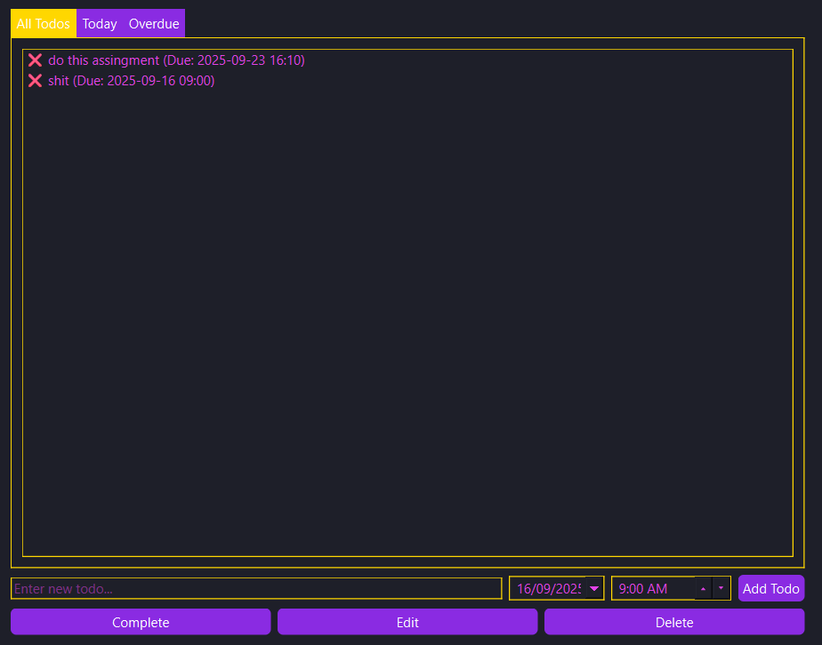

#### Issues and Solutions

### Prototype 5: Suggested Systems - Gym Tracking

#### Code as of commit 76

```py

  

```

#### Video of Functionality

[](https://www.youtube.com/watch?v=P98RAPgDNbo)

#### New UI Elements

##### Gym Page

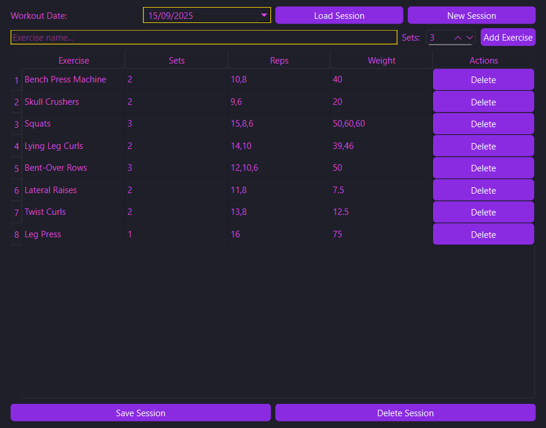

#### Issues and Solutions

### Prototype 6: Sorting and Searching

#### Code as of commit XX

```py

  

```

#### Video of Functionality

[](https://www.youtube.com/watch?v=)

#### New UI Elements

#### Issues and Solutions

### Prototype 7: IF I GET MORE TIME

#### Code as of commit XX

```py

  

```

#### Video of Functionality

[](https://www.youtube.com/watch?v=)

#### New UI Elements

### Issues and Solutions

## Reflection

### How is the Overall Design

### What Changes can I make

### What issues were Encountered

### What techniques did you use to solve these issues

### What have I learnt from the project

## Sources

[Qt for Python](https://doc.qt.io/qtforpython-6/index.html)

[PyQt6 Documentation](https://www.pythonguis.com/pyqt6-tutorial)
