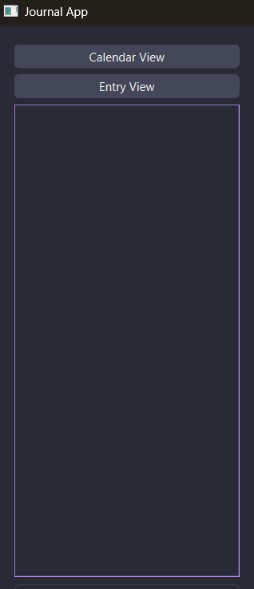

# Journal App

## Table of Contents

- [User Manual](#user-manual)
- [Preplanning](#preplanning)
  - [Core Features](#core-features)
  - [What Additional Feature I Will Add](#what-additional-features-i-will-add)
  - [Flowchart](#flowchart)
  - [UI Desing](#ui-design)
    - [Entry View](#entry-view)
    - [Calendar View](#calendar-view)
  - [Suggested Systems](#suggested-systems)
  - [If I Get More Time](#if-i-get-more-time)
- [Development](#development)
  - [Prototype 1](#prototype-1-base-systems-finished---text-edit-save-load-calendar-selection)
    - [Code Snippets](#code-snippets)
    - [Video Of Functionality](#video-of-functionality)
    - [New UI Elements](#new-ui-elements)
    - [Issues And Solutions](#issues-and-solutions)
  - [Prototype 2](#prototype-2-themes-and-more-advanced-text-options)
    - [Code Snippets](#code-snippets-1)
    - [Video Of Functionality](#video-of-functionality-1)
    - [New UI Elements](#new-ui-elements-1)
    - [Issues And Solutions](#issues-and-solutions-1)
  - [Prototype 3](#prototype-3-pinning-catogoriesing)
    - [Code Snippets](#code-snippets-2)
    - [Video Of Functionality](#video-of-functionality-2)
    - [New UI Elements](#new-ui-elements-2)
    - [Issues And Solutions](#issues-and-solutions-2)
  - [Prototype 4](#prototype-4-suggested-systems---todo-list)
    - [Code Snippets](#code-snippets-3)
    - [Video Of Functionality](#video-of-functionality-3)
    - [New UI Elements](#new-ui-elements-3)
    - [Issues And Solutions](#issues-and-solutions-3)
  - [Prototype 5](#prototype-5-suggested-systems---gym-tracking)
    - [Code Snippets](#code-snippets-4)
    - [Video Of Functionality](#video-of-functionality-4)
    - [New UI Elements](#new-ui-elements-4)
    - [Issues And Solutions](#issues-and-solutions-4)
  - [Prototype 6](#prototype-6-search-and-sort-entries)
    - [Code Snippets](#code-snippets-5)
    - [Video Of Functionality](#video-of-functionality-5)
    - [New UI Elements](#new-ui-elements-5)
    - [Issues And Solutions](#issues-and-solutions-5)
  - [Prototype 7](#final-version)
    - [Video Of Functionality](#video-of-functionality-6)
    - [Current UI](#current-ui)
- [Reflection](#reflection)
  - [How Is The Overall Design](#how-is-the-overall-design)
  - [What Changes Can I Make](#what-changes-can-i-make)
  - [Why Did I Change the Order of Development and How Did It Help](#why-did-i-change-the-order-of-development-and-how-did-it-help)
  - [What Have I Learnt From The Project](#what-have-i-learnt-from-the-project)
- [Sources](#sources)

## User Manual

Calendar Page:

Entry Page:

Side bar:

Todo List:

Gym Tracker:

Themes:

## Preplanning

### Core Features

Calendar Selection: the ability to view a calendar page and select a date to view. Dates with entries are highlighted.

Text Editor: Basic area which can have text entered into.

Save and Load: The saving of entries and their dates.

### What Additional Features I Will Add

Themes: The abilitie to change the appearance of the app to one of many preset themes, maybe expand to fully customisable without presets.

Advanced Text Settings: Enable bold, italic, and text size, maybe also color other than the theme one, maybe highlights.

Favourourite / Pinned: Enable the favouriting and pinning of entires which will be at the top of the side pannel even when sorting.

Catogories: Abilitie to enter any number of catogories in a field area, seperatored by commas.

Softing and filtering entries: Sort enries by date, title name, last opened and filter out specific catogories and uncatogoriesed entries.

Search Entries: a search field to look up entries based on their date or title.

### Flowchart

Belows is the flowchart on what order I wish to complete the assingment. Unfortionately after the making of the below Flowchart I added a new section on Suggested systems which goes inbetween the End section and if I Have more time.


### UI Design

Simple UI that resembles a IDE with the files / entires on a sidebar to the left, and a central field used for the input of text and the calendar selcetion. With text options above the text field, and a save button below the text field which i might also enable with a button for ctrl+s, next to which is the section for editing catogories.

#### Entry View


#### Calendar View


### Suggested Systems

After asking some or my peers i reseived the following suggestions:

To-Do List: Create a todo list where you can set a due date, and toggle between complete and incomplete. Also be able to see what is due today and what is overdue.

Events / Reminders: Allow the User to set reminders which it will then alert them of when it is near. Would require keeping the application open or finding a way to do it in a weird way.

Gym Tracking: Track what excersise you do, how many sets, reps and what weight it was.

Gabe has also suggested that i use some data prevention / guide user to save when they try to leave

I also questioned Kirsty which resulted in the following suggestions:

Change Font: Change between fonts for the Entries and maybe even the Ui of the App.

Emoji's or pictures to represent mood: Select a Emoji or picture to represent your mood that day.

Set the weather that day: Allow the user to select one or a few options for a weather button, or allow them to enter it in words.

### If I Get More Time

If i stop getting good suggestions from people, i intend to do the following if i get more time.

A Cloud back up system: Maybe use git or something similar to store entries.

Voice to text input: Possible text dictation but would require a mic and the ability to recognise words from the mic. 

## Development

### Prototype 1: Base Systems finished - Text Edit, Save Load, Calendar Selection

#### Code Snippets

```py

# Sidebar 
self.sidebar = QWidget()
sidebar_layout = QVBoxLayout(self.sidebar)

self.to_calendar_btn = QPushButton("Calendar View")
self.to_entry_btn = QPushButton("Entry View")
sidebar_layout.addWidget(self.to_calendar_btn)
sidebar_layout.addWidget(self.to_entry_btn)

# Entry list
self.entry_list = QListWidget()
sidebar_layout.addWidget(self.entry_list)

main_layout.addWidget(self.sidebar, 1)

```

```py

# Calendar Page 
self.calendar_page = QWidget()
cal_layout = QVBoxLayout(self.calendar_page)
self.calendar = QCalendarWidget()
cal_layout.addWidget(self.calendar)
self.stacked.addWidget(self.calendar_page)

# Entry Page 
self.entry_page = QWidget()
entry_layout = QVBoxLayout(self.entry_page)

self.entry_title_label = QLabel("No entry loaded")
entry_layout.addWidget(self.entry_title_label)

self.text_edit = QTextEdit()
entry_layout.addWidget(self.text_edit)

self.save_btn = QPushButton("Save Entry")
entry_layout.addWidget(self.save_btn)

self.stacked.addWidget(self.entry_page)

```

```py

# Save and Load Entries
def save_entry(self):
    date = self.calendar.selectedDate().toString("yyyy-MM-dd")
    content = self.text_edit.toPlainText()

    existing = next((e for e in self.entries if e["date"] == date), None)
    if existing:
        existing["content"] = content
    else:
        title, ok = QInputDialog.getText(self, "Entry Title", "Enter a title for this entry:")
        if not ok or not title.strip():
            title = "Untitled"
        self.entries.append({"date": date, "title": title.strip(), "content": content})

    self.save_entries()
    self.refresh_entry_list()
    self.highlight_entries()

def load_entry_for_date(self):
    date = self.calendar.selectedDate().toString("yyyy-MM-dd")
    entry = next((e for e in self.entries if e["date"] == date), None)
    if entry:
        self.text_edit.setText(entry["content"])
        self.entry_title_label.setText(f"{entry['title']} - {date}")
    else:
        self.text_edit.clear()
        self.entry_title_label.setText(f"New Entry - {date}")

```

```py

# Highlight Calendar Dates 
def highlight_entries(self):
    theme = THEMES.get(self.current_theme, THEMES["Dark"])
    has_entry_format = QTextCharFormat()
    has_entry_format.setBackground(QBrush(QColor(theme["highlight"])))

    for entry in self.entries:
        date = QDate.fromString(entry["date"], "yyyy-MM-dd")
        self.calendar.setDateTextFormat(date, has_entry_format)

```

#### Video of Functionality

Sorry about the low quality videos I couldn't figure out why its doing this, so you will just have to deal with these 360p versions.

[](https://www.youtube.com/watch?v=RfsdXi8gLjs)

#### New UI Elements

The current interface consists of a sidebar and a stacked widget that switches between the calendar and entry views.  

##### Entry View

Users can write their journal entries, view the date, and save the entries.


##### Calendar View

Users can select dates and view which days have entries already.


##### Side Bar

Users can use the sidebar to switch between the views aswell as view all entries. 



#### Issues and Solutions

I use Linux at home and Windows for school, and I also needed to make this project usable for you. This required making the file-loading systems cross-OS compatible, which required handling the different slashes used in file directories. This was fixed by using `os.path.join()` so python automaticly uses the correct file depending on the operating system. 

### Prototype 2: Themes and More advanced text options

#### Code Snippets

```py

# Theme selector in sidebar
self.theme_selector = QComboBox()
self.theme_selector.addItems(THEMES.keys())
sidebar_layout.addWidget(self.theme_selector)
self.theme_selector.currentTextChanged.connect(self.apply_theme)

```

```py

def save_entry(self):
    date = self.calendar.selectedDate().toString("yyyy-MM-dd")
    content = self.text_edit.toHtml()

    # find existing entry for date
    existing = next((e for e in self.entries if e["date"] == date), None)

    if existing:
        existing["content"] = content
    else:
        # Prompt for a title when creating a new entry
        title, ok = QInputDialog.getText(self, "Entry Title", "Enter a title for this entry:")
        if not ok or not title.strip():
            title = "Untitled"
        self.entries.append({"date": date, "title": title.strip(), "content": content})

    self.save_entries()
    self.refresh_entry_list()
    self.highlight_entries()
   
```

```py

# Advanced text fuctions
def toggle_bold(self):
    fmt = self.text_edit.currentCharFormat()
    fmt.setFontWeight(QFont.Weight.Bold if self.bold_btn.isChecked() else QFont.Weight.Normal)
    self.text_edit.setCurrentCharFormat(fmt)

def toggle_italic(self):
    fmt = self.text_edit.currentCharFormat()
    fmt.setFontItalic(self.italic_btn.isChecked())
    self.text_edit.setCurrentCharFormat(fmt)

def change_font_size(self, size):
    fmt = self.text_edit.currentCharFormat()
    fmt.setFontPointSize(size)
    self.text_edit.setCurrentCharFormat(fmt)

```

#### Video of Functionality

[](https://www.youtube.com/watch?v=5iDJJPJeIvo)

#### New UI Elements

Theme selector as a dropdown from the sidebar. 

Text formatting section in the entry view with a bold, italic and font size selector. 

##### Theme Selector


##### Text options


#### Issues and Solutions

The chosen theme would be correctly applied on startup, but the theme selection dropdown box would still show the default theme. To fix this when loading it would check if a theme had been saved then it would find the index of that theme and set the selection box to the correct index. 

After changing to use HTML formatting, the sidebar's preview would show the raw HTML text. I ended up fixing this by creating the entry title and using that as the preview instead. 

### Prototype 3: Pinning, catogoriesing

#### Code Snippets

```py

# Pin toggle button in entry header
self.pin_btn = QPushButton("📌")
self.pin_btn.setCheckable(True)
self.pin_btn.setFixedSize(24, 24)
self.pin_btn.toggled.connect(self.toggle_pin)
header_layout.addWidget(self.pin_btn)

# Categories button in actions row
self.categories_btn = QPushButton("🏷")
self.categories_btn.setFixedSize(24, 24)
self.categories_btn.clicked.connect(self.edit_categories)
actions_layout.addWidget(self.categories_btn)

# Delete button in sidebar
self.delete_btn = QPushButton("Delete Entry")
self.delete_btn.clicked.connect(self.delete_entry)
sidebar_layout.addWidget(self.delete_btn)

```

```py

# Refresh entry list with pinned items first
def refresh_entry_list(self):
    self.entry_list.clear()

    pinned = [e for e in self.entries if e.get("pinned")]
    others = [e for e in self.entries if not e.get("pinned")]

    pinned = sorted(pinned, key=lambda x: x["date"])
    others = sorted(others, key=lambda x: x["date"])

    def make_item(entry, pinned=False):
        cats = ", ".join(entry.get("categories", []))
        label = f"{'📌 ' if pinned else ''}{entry['date']} - {entry['title']} "
        if cats:
            label += f" [{cats}]"
        item = QListWidgetItem(label)
        item.setData(Qt.ItemDataRole.UserRole, entry["date"])
        return item

    for entry in pinned:
        self.entry_list.addItem(make_item(entry, pinned=True))

    for entry in others:
        self.entry_list.addItem(make_item(entry))

```

```py

# Pin toggle handler
def toggle_pin(self, checked):
    date = self.calendar.selectedDate().toString("yyyy-MM-dd")
    entry = next((e for e in self.entries if e["date"] == date), None)
    if entry:
        entry["pinned"] = checked
        self.save_entries()
        self.refresh_entry_list()
        self.highlight_entries()

```

```py

# Categories editor
def edit_categories(self):
    date = self.calendar.selectedDate().toString("yyyy-MM-dd")
    entry = next((e for e in self.entries if e["date"] == date), None)
    if entry:
        current = ", ".join(entry.get("categories", []))
        text, ok = QInputDialog.getText(
            self, "Edit Categories", "Enter categories (comma-separated):", text=current
        )
        if ok:
            cats = [c.strip() for c in text.split(",") if c.strip()]
            entry["categories"] = cats
            self.save_entries()
            self.refresh_entry_list()

```

```py

# Delete entry with confirmation
def delete_entry(self):
    date = self.calendar.selectedDate().toString("yyyy-MM-dd")
    entry = next((e for e in self.entries if e["date"] == date), None)

    if not entry:
        QMessageBox.information(self, "No Entry", "There is no entry for this date to delete.")
        return

    reply = QMessageBox.question(
        self,
        "Delete Entry",
        f"Are you sure you want to delete the entry for {date}?",
        QMessageBox.StandardButton.Yes | QMessageBox.StandardButton.No
    )

    if reply == QMessageBox.StandardButton.Yes:
        self.entries = [e for e in self.entries if e["date"] != date]
        self.save_entries()
        self.refresh_entry_list()
        self.highlight_entries()
        self.text_edit.clear()
        self.entry_title_label.setText(f"Deleted Entry - {date}")

```

#### Video of Functionality

[](https://www.youtube.com/watch?v=UPA5kW2vdBs)

#### New UI Elements

Pin Button: Allows for an entry to be pinned. With pinned entries appearing at the top of the sidebar and highlighted with a diffirent color in the calendar

Catogory Button: Opens a text input where you can specify the catogoires of the entry, which will then be displayed next to the entry in the entry list. 

Delete Button: Finally decided that the user should be able to delete an entry. By adding a button at the bottom of the sidebar, which deletes the selected entry, after waiting for a confirmation.

##### Pinning Button


##### Catogories Button and Input Dialogue


##### Sidebar With Pinned Entry, Catogories, and Delete Button


#### Issues and Solutions

When you pin an entry or added a catogory, the sidebar and calendar would not update until you refreshed the app by selecting a new date or saving again. It was a simple fix of just calling the refresh and highlight functions again but i hadn't thaught to do it even though pinning and catogoriesing didn't need saving to actually save.

When entering catogories it would allow you to enter just commas, whitespace or nothing and which would add blank catogories to the list, it was also possible to have multiple of the same catogories. These were fixed by removing any blank entries with .strip() to remove white space and .stip(",") to seperate catogories, and multiple of the same were filtered out. 

Pinned entries in the sidebar would not open when clicked, although could be accessed from the calendar view. this was because when loading from the sidebar, it would find the clicked entry by using its displayed text. With the pinned entries staring with a pin symbol, which broke this function. It was fixed by using the entries saved date to locate the entry instead.

### Prototype 4: Suggested Systems - Todo List

#### Code Snippets

```py

self.to_todo_btn = QPushButton("Todo List")
sidebar_layout.addWidget(self.to_todo_btn)
self.to_todo_btn.clicked.connect(
    lambda: self.stacked.setCurrentWidget(self.todo_page)
)

```

```py

# Todo list page with tabs
self.todo_page = QWidget()
todo_layout = QVBoxLayout(self.todo_page)

self.todo_tabs = QTabWidget()
todo_layout.addWidget(self.todo_tabs)

# All Todos tab
self.all_todos_tab = QWidget()
all_todos_layout = QVBoxLayout(self.all_todos_tab)
self.todo_list = QListWidget()
all_todos_layout.addWidget(self.todo_list)
self.todo_tabs.addTab(self.all_todos_tab, "All Todos")

# Today’s Todos tab
self.today_todos_tab = QWidget()
today_todos_layout = QVBoxLayout(self.today_todos_tab)
self.today_todo_list = QListWidget()
today_todos_layout.addWidget(self.today_todo_list)
self.todo_tabs.addTab(self.today_todos_tab, "Today")

# Overdue Todos tab
self.overdue_todos_tab = QWidget()
overdue_todos_layout = QVBoxLayout(self.overdue_todos_tab)
self.overdue_todo_list = QListWidget()
overdue_todos_layout.addWidget(self.overdue_todo_list)
self.todo_tabs.addTab(self.overdue_todos_tab, "Overdue")

```

```py

def add_todo(self):
    text = self.todo_input.text().strip()
    if not text:
        return

    date = self.todo_date.date().toString("yyyy-MM-dd")
    time = self.todo_time.time().toString("HH:mm")
    datetime_str = f"{date} {time}"

    todo = {
        "id": datetime.now().strftime("%Y%m%d%H%M%S"),
        "text": text,
        "datetime": datetime_str,
        "completed": False,
        "created": datetime.now().strftime("%Y-%m-%d %H:%M")
    }

    self.todos.append(todo)
    self.save_todos()
    self.refresh_todo_lists()
    self.todo_input.clear()

```

```py

# Todo actions
def complete_todo(self):
    current_item = self.todo_list.currentItem()
    if not current_item:
        return
    todo_id = current_item.data(Qt.ItemDataRole.UserRole)
    for todo in self.todos:
        if todo["id"] == todo_id:
            todo["completed"] = not todo["completed"]
    self.save_todos()
    self.refresh_todo_lists()

 def edit_todo(self):
    # Get currently selected item
    current_item = self.todo_list.currentItem()
    if not current_item:
        return
    
    # Find corresponding todo
    todo_id = current_item.data(Qt.ItemDataRole.UserRole)
    todo = next((t for t in self.todos if t["id"] == todo_id), None)
    if not todo:
        return
    
    # Prompt for new text
    text, ok = QInputDialog.getText(self, "Edit Todo", "Update todo text:", text=todo["text"])
    if ok and text.strip():
        todo["text"] = text.strip()
        
        # Prompt for new date/time
        current_datetime = datetime.strptime(todo["datetime"], "%Y-%m-%d %H:%M")
        new_datetime, ok = QInputDialog.getText(self, "Edit Todo", "Update due date and time (YYYY-MM-DD HH:MM):", text=todo["datetime"])
        if ok and new_datetime.strip():
            try:
                datetime.strptime(new_datetime.strip(), "%Y-%m-%d %H:%M")
                todo["datetime"] = new_datetime.strip()
            except ValueError:
                QMessageBox.warning(self, "Invalid DateTime", "The date and time format is invalid. Keeping the old value.")
        
    # Save changes and refresh lists
    self.save_todos()
    self.refresh_todo_lists()

def delete_todo(self):
    current_item = self.todo_list.currentItem()
    if not current_item:
        return
    
    # Confirm deletion
    todo_id = current_item.data(Qt.ItemDataRole.UserRole)
    reply = QMessageBox.question(
        self,
        "Delete Todo",
        "Are you sure you want to delete this todo?",
        QMessageBox.StandardButton.Yes | QMessageBox.StandardButton.No
    )

    # If confirmed, delete todo
    if reply == QMessageBox.StandardButton.Yes:
        self.todos = [t for t in self.todos if t["id"] != todo_id]
        self.save_todos()
        self.refresh_todo_lists()

```

#### Video of Functionality

[](https://www.youtube.com/watch?v=VvO13jhg0RQ)

#### New UI Elements

Todo Page: A new page was added to the stacked widget, with three internal tabs, one for all the todos, todays todos, and overdue tasks.

New Todos: At the bottom of the page, a text field with a date and time picker was added to allow users to create todos and specify the deadlines. 

Todo Buttons: Three buttons were also added to complete, edit, and delete the selected todos. 

##### Todo Page


#### Issues and Solutions

At first when completing a todo it would automatically remove it from the list, which made it impossible to unmark something if it was clicked by mistake. I changed this so that completed todos remain in the list and are displayed with a checkmark. With clicking them again toggling the completed status of the todos.

When editing ToDos it originally required typing out the due date and time manually in the specified format, which could of caused errors if it was wrong. I then changed this to give a string already formatted in the correct way with only the numbers requiring changes. 

### Prototype 5: Suggested Systems - Gym Tracking

#### Code Snippets

```py

# Sidebar button for Gym Tracking
self.to_gym_btn = QPushButton("Gym Tracking")
sidebar_layout.addWidget(self.to_gym_btn)
self.to_gym_btn.clicked.connect(
    lambda: self.stacked.setCurrentWidget(self.gym_page)
)

```

```py

# Gym Tracking page setup
self.gym_page = QWidget()
gym_layout = QVBoxLayout(self.gym_page)

# Session date and load/new buttons
session_layout = QHBoxLayout()
self.session_date = QDateEdit()
self.session_date.setDate(QDate.currentDate())
self.session_date.setCalendarPopup(True)
session_layout.addWidget(QLabel("Workout Date:"))
session_layout.addWidget(self.session_date)

self.load_session_btn = QPushButton("Load Session")
self.load_session_btn.clicked.connect(self.load_workout_session)
session_layout.addWidget(self.load_session_btn)

self.new_session_btn = QPushButton("New Session")
self.new_session_btn.clicked.connect(self.create_new_session)
session_layout.addWidget(self.new_session_btn)

gym_layout.addLayout(session_layout)

# Add exercise form
exercise_form_layout = QHBoxLayout()
self.exercise_input = QLineEdit()
self.exercise_input.setPlaceholderText("Exercise name...")
exercise_form_layout.addWidget(self.exercise_input)

self.sets_input = QSpinBox()
self.sets_input.setRange(1, 10)
self.sets_input.setValue(3)
exercise_form_layout.addWidget(QLabel("Sets:"))
exercise_form_layout.addWidget(self.sets_input)

self.add_exercise_btn = QPushButton("Add Exercise")
self.add_exercise_btn.clicked.connect(self.add_exercise)
exercise_form_layout.addWidget(self.add_exercise_btn)

gym_layout.addLayout(exercise_form_layout)

```

```py

# Exercises table
self.exercises_table = QTableWidget()
self.exercises_table.setColumnCount(5)
self.exercises_table.setHorizontalHeaderLabels(
    ["Exercise", "Sets", "Reps", "Weight", "Actions"]
)
self.exercises_table.horizontalHeader().setSectionResizeMode(QHeaderView.ResizeMode.Stretch)
gym_layout.addWidget(self.exercises_table)

```

```py

# Adding an exercise to the current session
def add_exercise(self):
    if not self.current_session:
        QMessageBox.warning(self, "No Session", "Please create or load a workout session first.")
        return

    name = self.exercise_input.text().strip()
    if not name:
        QMessageBox.warning(self, "Input Error", "Please enter an exercise name.")
        return

    exercise = {"name": name, "sets": self.sets_input.value(), "reps": "", "weight": ""}
    self.current_session["exercises"].append(exercise)

    # Add to table
    row = self.exercises_table.rowCount()
    self.exercises_table.insertRow(row)
    self.exercises_table.setItem(row, 0, QTableWidgetItem(exercise["name"]))
    self.exercises_table.setItem(row, 1, QTableWidgetItem(str(exercise["sets"])))
    self.exercises_table.setItem(row, 2, QTableWidgetItem(""))
    self.exercises_table.setItem(row, 3, QTableWidgetItem(""))

    del_btn = QPushButton("Delete")
    del_btn.clicked.connect(lambda _, r=row: self.delete_exercise(r))
    self.exercises_table.setCellWidget(row, 4, del_btn)

    self.exercise_input.clear()

```

#### Video of Functionality

[](https://www.youtube.com/watch?v=WaCVO8xWK-Q)

#### New UI Elements

Gym Page: At the top of the page there is a date selector, alongside buttons to load an existing session or create a new one for the selected date. Below this is an input section where you can enter the name of an exercise and the number of sets, which are then added to the session list. In the list, the number of reps and the weight are editable, and a delete button is next to each exercise. At the bottom of the page, buttons were added to save the current session or delete it. 

##### Gym Page


#### Issues and Solutions

In the early stages, trying to add an exercise without first creating or loading a session caused the app to crash. This was solved by checking if a session existed and showing a warning if it did not.

When creating a new session on a date that already had one, the app would overwrite it. This was fixed by prompting the user with a confirmation dialogue asking if they wanted to load the existing session instead.

### Prototype 6: Search and Sort Entries

#### Code Snippets

```py

search_layout = QHBoxLayout()

self.search_input = QLineEdit()
self.search_input.setPlaceholderText("Search entries...")
self.search_input.setToolTip("Search entries. Type to filter the entry list.") 
self.search_input.textChanged.connect(self.refresh_entry_list)
search_layout.addWidget(self.search_input)

self.search_type_selector = QPushButton()
self.search_type_selector.setText("Title")
self.search_type_selector.setToolTip("Click to change search type between Title, Date, Categories")
# cycle between Title, Date, Categories on click
self.search_type_selector.clicked.connect(self.cycle_search_type)

search_layout.addWidget(self.search_type_selector)

sidebar_layout.addLayout(search_layout)

self.sort_selector = QComboBox()
self.sort_selector.addItems(["Pinned First","Date", "Title", "Last Opened", ])
self.sort_selector.setToolTip("Select sorting mode")
self.sort_selector.currentTextChanged.connect(self.refresh_entry_list)
sidebar_layout.addWidget(self.sort_selector)


```

```py

  def refresh_entry_list(self):
    self.entry_list.clear() # Clear existing items
        
    query = self.search_input.text().strip().lower()
    filter_type = self.search_type_selector.text()
    filtered_entries = [
        e for e in self.entries
        if filter_type == "Title" and query in e["title"].lower()
        or filter_type == "Date" and query in e["date"]
        or filter_type == "Categories" and (isinstance(e.get("categories"), list) and any(query in category.lower() for category in e["categories"]))
    ]

    sort_mode = self.sort_selector.currentText()

    if sort_mode == "Date":
        filtered_entries.sort(key=lambda x: x["date"])
    elif sort_mode == "Title":
        filtered_entries.sort(key=lambda x: x["title"].lower())
    elif sort_mode == "Last Opened":
        filtered_entries.sort(key=lambda x: x.get("last_opened", ""),reverse=True)
    elif sort_mode == "Pinned First":
        # Pinned entries to top, then sort by date
        pinned = [e for e in filtered_entries if e.get("pinned")]
        others = [e for e in filtered_entries if not e.get("pinned")]
        pinned.sort(key=lambda x: x["date"])
        others.sort(key=lambda x: x["date"])
        filtered_entries = pinned + others

    for entry in filtered_entries:
        cats = ", ".join(entry.get("categories", []))
        label = f"{'📌 ' if entry.get('pinned') else ''}{entry['date']} - {entry['title']}"
        if cats:
            label += f" [{cats}]"
        item = QListWidgetItem(label)
        item.setData(Qt.ItemDataRole.UserRole, entry["date"])
        self.entry_list.addItem(item)

```

#### Video of Functionality

[](https://www.youtube.com/watch?v=s9td_0WJpkE)

#### New UI Elements

##### Search and Sort Fields


### Issues and Solutions

Sorting by title, first appearance, and last edited was initially reversed because of how the sort function was implemented, so I adjusted it to display entries in the correct order. 

Searching for “2” returned every entry since the year “2025” was included in all dates, which meant the filter never worked properly. To fix this, I added search options that let the user toggle whether the search checks the title, date, or categories, giving more control and avoiding unwanted matches. 

### Final Version

#### Video of Functionality

[](https://www.youtube.com/watch?v=6XyZaPrGOiE)

#### Current UI

Below is how the UI ended up looking.


## Reflection

### How is the Overall Design

I think the overall design makes sense. The calendar is the main view which the user starts in, since it connects directly into the entries tab. Although I didn't have time to integrate the todo list and gym tracker into the calendar, like I had planned, I still think those tabs work fine on their own. the sidebar feels clean to me wit hthe calendar button at the top with the three views below it. Along with having the entry list and its ability to be sorted and searched, makes it easy to find entries. The themes also made the app feel more personal and usable.

### What Changes can I make

If I had more time, the first changes I would make would be finish integrating the todo and gym tracker into the calendar. I imagined it would work the same way as entry highlighting, with different symbols or sections showing what was on that day. I'd also like ot add some smaller features like more customisable text options, and maybe try to implement the ideas I had ath the start, such as cloud backups or voice dictation. I would also like to redesign the three tabs on the todo page, which felt like a good idea at first but became a bit clutered after implementation. The gym page could also be more streamlined, since right now you have ot make a new session before adding exercises. I think it would feel better if adding an exercise would automatically create a session for that day. 

### Why did I change the order of development and how did it help

I changed the order of development a few times as I went. At the start I didn't eplan on having the todo and gym tracking systems, but after talking to some friends I decided to add them. I also delayed the sorting and searching systems because I thought it would be more complicated than it ended up been. 

### What have I learnt from the project

1. Aposed to the practice / learning classes before this project i decide to use the qt desinger but for this i decided agaisnt that becuase 1 it didn't have all the qwidgets i ended up using and it felt a bit figide and and less intuitive for stuff like layouts 

2. First project i have done where data storage was a major element i had done some small things before such as saving a highscore and highscore holder not not big data in jsons 

3. ignore This question

4. first true app i have made aside from the previous games we usually do. It was a very diffirent process to making a game which was an intresting progress. 

5. ignore question

## Sources

[Qt for Python](https://doc.qt.io/qtforpython-6/index.html)

[PyQt6 Documentation](https://www.pythonguis.com/pyqt6-tutorial)
